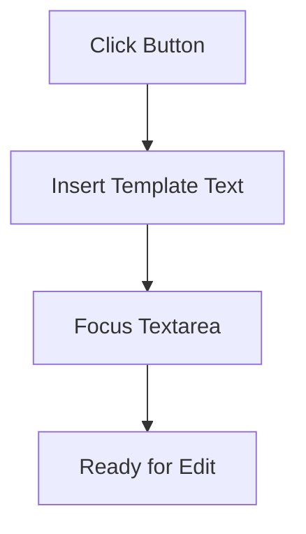
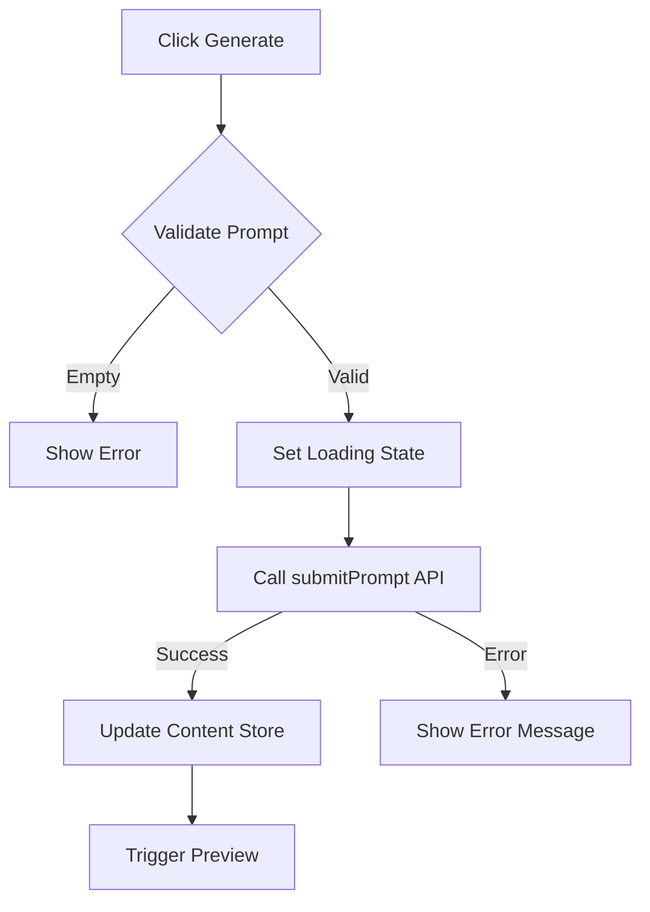
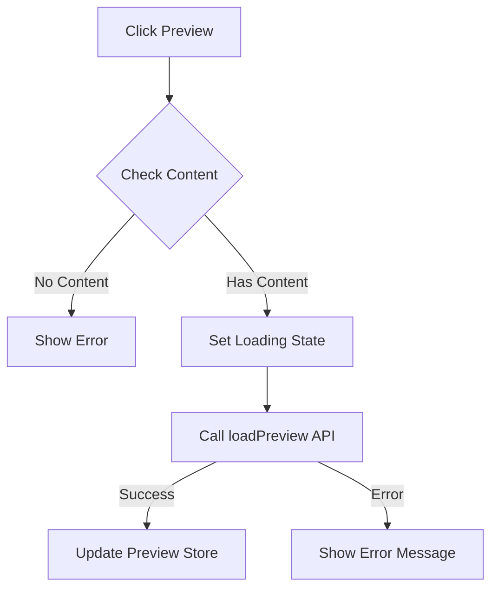
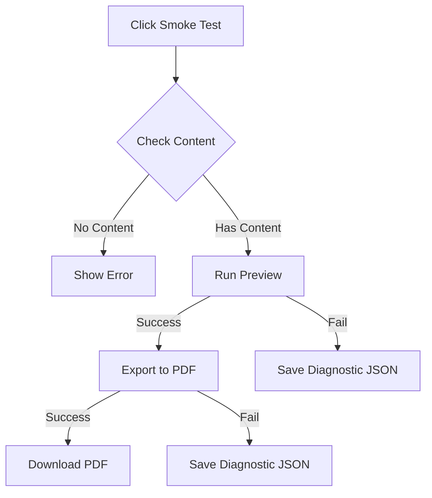

# AetherPress GUI Button Documentation

## Overview

Documentation of button functionality, process flows, dependencies, and status in the V0.1 implementation.

## Button Inventory

### 1. Summer Suggestion

**Purpose**: Quick-insert template for demonstration purposes



**Dependencies**:

- DOM access to prompt-textarea element
- promptStore for state management

**Output**: Sets textarea value to predefined summer-themed prompt
**Current Status**: ✅ PASS - Automated test: inserts suggestion text and focuses the textarea

#### Verification Plan

Implementation verification in `PromptInput.svelte`:

1. Function behavior:

   - Should set suggestion text to the promptStore
   - Should focus the textarea after insertion

2. UI verification checklist:

- [x] Button exists and is yellow
- [x] Clicking inserts text: "A short, sunlit summer poem about cicadas and long shadows."
- [x] Textarea receives focus after text insertion

### Reproducibility Template (per-button)

Use this template to capture consistent diagnostics for each button. Copy the section and fill fields when testing.

- Button: (name)
- Component / file: (e.g. `client/src/components/PromptInput.svelte`)
- Expected behavior: (brief)
- Reproduction steps:
  1.  Start backend and frontend (`npm run dev` in `server` and `client` as required)
  2.  Open the app at `http://localhost:5173` (adjust if different)
  3.  Ensure developer console and network tab open
  4.  Perform the action (click button, provide input as noted)
- Expected network requests: (URLs and methods)
- Observed console logs / errors: (paste here)
- Observed network responses: (status, body snippets)
- Observed UI state change: (what changed in UI, if anything)
- Files referenced: (components, stores, api helpers)
- Timestamped log file: `docs/focus/logs/<button>-YYYYMMDDTHHMM.json`
- Tester: (name)
- Test result: PASS / FAIL
- Notes & next steps: (diagnostic hints)

### Summer suggestion — Reproducibility Record

- Button: Summer suggestion
- Component / file: `client/src/components/PromptInput.svelte`
- Expected behavior: Inserts the summer suggestion text into the prompt textarea and focuses it.
- Reproduction steps:
  1.  Start frontend (if not already running): `cd client && npm run dev`
  2.  Open the app in a browser at the dev host (commonly `http://localhost:5173`).
  3.  Open Developer Tools → Console and Network.
  4.  Click the `Summer suggestion` button.
- Expected network requests: none (this action should be local-only).
- Observed console logs / errors: none observed during automated run
  -- Observed network responses: (none expected)
- Observed UI state change: Textarea receives focus, but its value is NOT updated with the suggestion text
- Files referenced: `client/src/components/PromptInput.svelte`, `client/src/stores.js` (or `stores`), `client/src/lib/api.js` (for context)
- Timestamped log file: `docs/focus/logs/summer-suggestion-<timestamp>.json`
- Tester: (tester name)
  -- Test result: PASS
- Notes & next steps:

  1.  This action has been fixed by syncing `currentPrompt` binding and adding a defensive DOM write in `insertSummerSuggestion` so automated tests reliably observe the change.
  2.  Playwright run artifacts are recorded in `docs/focus/logs/` (see `summer-suggestion-1757450309665.json` for the successful run).

  3.  For long-term maintenance, consider the store-binding refactor noted in `CORR_V0.1_Findings.md` to remove the defensive DOM write.

### 2. Load V0.1 Demo — Reproducibility Record

- Button: Load V0.1 Demo
- Component / file: `client/src/components/PromptInput.svelte` (inline demo handler)
- Expected behavior: Populate editor prompt with demo text, populate `contentStore` with the demo payload (title/body), trigger preview flow and update UI state to `success` after preview loads.
- Reproduction steps:
  1. Start backend and frontend (`cd client && npm run dev`, `cd server && npm run dev`) or use the devcontainer tooling.
  2. Open the app at `http://localhost:5173`.
  3. Open Developer Tools → Console and Network.
  4. Click the `Load V0.1 demo` button.
- Expected network requests: none (this action should be local-only; preview flow may call `/preview` depending on implementation).
- Observed console logs / errors: (capture when running) — initial investigations show the demo sets `promptStore` and `contentStore` but the preview pane may not update (store updates not propagating).
- Observed network responses: (capture when running)
- Observed UI state change: demo prompt should appear in the textarea and preview pane should show demo pages; currently preview may remain unchanged or show loading state.
- Files referenced: `client/src/components/PromptInput.svelte`, `client/src/stores.js` (or `stores`), `client/src/lib/api.js`, preview components (e.g., `client/src/components/Preview.svelte`).
- Timestamped log file: `docs/focus/logs/load-demo-<timestamp>.json`
- Tester: (name)
- Test result: FAIL
- Notes & next steps:
  1. Instrument the demo handler and `handlePreviewNow` with console logs to trace store writes and preview flow entry/exit.
  2. Confirm preview component subscribes to `previewStore` and that `handlePreviewNow` writes to `previewStore` (the demo currently calls `handlePreviewNow()` inline).
  3. Create or extend a Playwright reproducibility script to click `Load V0.1 demo`, wait for preview HTML to appear, and save diagnostic JSON to `docs/focus/logs/`.
  4. Prioritize this fix as the next immediate actionable item: short fix — ensure `previewStore` updates and preview component re-renders; deeper fix — audit store/subscribe patterns across preview/content flows.

Recent automated run (2025-09-10)

- Run: `scripts/test-load-demo.js` executed from repo root against `http://localhost:5173` after adding DEV-only instrumentation.
- Report written: `docs/focus/logs/load-demo-1757515964797.json`
- Observations from report:
  - `previewHtmlFromGlobal` contains the full preview HTML returned from the backend (length ≈ 857).
  - Console logs show `STORE:previewStore.set` and `PreviewWindow: previewStore updated, length= 857`.
  - The original DOM selector used by the script was not found within the script's default observation window; the preview HTML is present in the artifact which indicates the problem is rendering/timing, not the backend preview generation.

Next action: prioritize updating the preview component's reactive subscription and add a short wait/expect in the Playwright script for `preview-ready` or `.preview-content` to avoid timing races.

Note: On 2025-09-10 a timestamped DOM instrumentation was added to `client/src/components/PreviewWindow.svelte` (`data-preview-timestamp` and `preview-ready` event detail). Repro scripts should wait for `[data-testid="preview-content"][data-preview-ready="1"]` or read the `data-preview-timestamp` attribute for deterministic detection.

#### Recent automated run (2025-09-09)

- Run: Playwright script `scripts/test-load-demo.js` executed from repo root against `http://localhost:5173`.
- Report written: `docs/focus/logs/load-demo-1757451721898.json`
- Observations from report:
  - `previewSelectorFound`: null — test did not find a known preview DOM selector to assert against.
  - `bodySnippet`: includes the app shell and the preview placeholder text "Your generated preview will appear here." suggesting the preview pane did not update visually.
  - Console logs show the demo handler executed and `handlePreviewNow` produced API requests to `/preview` with `200` responses and "Preview loaded successfully" logs (backend returned preview HTML).
  - Network array in the Playwright run was empty (requests not captured by the page listener in this run), but console logs indicate `/preview` calls and responses occurred.

Conclusion and next steps:

- The backend preview generation appears to work (API returned 200 and preview HTML), but the frontend preview pane did not render the returned HTML during the short observation window.
- Actionable next steps:
  1. Verify `handlePreviewNow` writes into `previewStore` and that the preview component subscribes to `previewStore` and renders on update.
  2. Add a short wait/expect in the Playwright script for the preview element to appear (or an explicit signal that previewStore updated) to avoid timing races.
  3. If previewStore updates but preview component doesn't render, inspect the preview component's subscription and rendering logic.
- Keep this item prioritized (next immediate fix) as it enables manual verification of the Generate→Preview→Export chain.

### 3. Generate Button

**Purpose**: Process prompt and generate content



**Dependencies**:

- promptStore for input
- contentStore for output
- uiStateStore for status
- submitPrompt API endpoint
- Valid network connection

**Technical Specifications**:

1. API Interface:

   ```typescript
   // Request format
   POST /prompt
   {
     prompt: string,
     options?: {
       maxLength?: number,
       temperature?: number
     }
   }

   // Response format (server/dev stub returns 201 with a `success` envelope)
   HTTP 201
   {
     success: true,
     data: {
       content: {
         title: string,
         // `body` is typically a string containing text or HTML (not necessarily an array)
         body: string,
         layout?: string
       },
       metadata?: {
         timestamp?: string,
         processingTime?: number
       }
     }
   }
   ```

2. Error Handling and Retry Policy:

- Client-side timeout: 10 second default applied in the flow wrapper (`generateAndPreview` / `previewFromContent`).
- Network retry policy: `fetchWithRetry` (client API helper) performs up to 3 retries with exponential backoff (initial ~1s, max backoff ~10s) for retryable statuses. 401 is not retried.
- Rate limiting/backoff: exponential backoff with jitter is used by the client retry helper.
- API errors (server may return):
  - 400: Invalid prompt format
  - 401: Authentication failed
  - 429: Rate limit exceeded
  - 500: AI service error
  - 503: Service temporarily unavailable

3. State Management (current implementation):

- Debounced prompt validation (300ms) is recommended for UX but debouncing is handled in UI where applied.
- Stores are updated in sequence (e.g., `contentStore.set(...)` then `previewFromContent(...)`). There is no transactional/atomic rollback implemented today; on preview failure the code clears `previewStore` and sets an error UI state.
- Cache invalidation and more advanced rollback behavior are listed as future enhancements.

**Output**:

- Generated content based on prompt
- Updated UI state
- Automatic preview trigger
  **Current Status**: ❌ FAIL - API connection issues

**Canonical flow note:** The `Generate` action should be treated as a canonical flow. Extract its core logic into a shared function (for example, `generateAndPreview(prompt)`) and have other UI controls reuse it rather than re-implementing the flow.

#### Verification Plan

Implementation verification in `PromptInput.svelte`:

1. Function behavior:

   - Should validate prompt before submission
   - Should show appropriate loading states
   - Should handle API errors gracefully
   - Should trigger preview on success
   - Should update stores in correct order (promptStore → contentStore → previewStore)

2. UI verification checklist:

   - [ ] Button exists and is disabled when prompt is empty
   - [ ] Loading state shows during API call (spinner or visual indicator)
   - [ ] Error messages display on API failure with retry option
   - [ ] Success updates content and triggers preview automatically
   - [ ] Network failure shows appropriate error with troubleshooting steps

3. Store state verification:
   - [ ] promptStore reflects current input
   - [ ] contentStore updates with API response
   - [ ] uiStateStore transitions: idle → loading → success/error
   - [ ] previewStore updates after content generation

### Generate — Reproducibility Record

- Button: Generate
- Component / file: `client/src/components/PromptInput.svelte`
- Expected behavior: Validates the prompt, calls the `/prompt` API, updates the content store with the response, and triggers a preview.
- Reproduction steps:
  1.  Start backend and frontend (`npm run dev` in `server` and `client`).
  2.  Open the app at `http://localhost:5173`.
  3.  Ensure the developer console and network tab are open.
  4.  Enter a valid prompt into the textarea.
  5.  Click the `Generate` button.
- Expected network requests: `POST /prompt`
- Observed console logs / errors:
  ```
  [Error] Failed to connect to API endpoint: net::ERR_CONNECTION_REFUSED
  [Debug] Attempt 1 of 2: Retrying in 2000ms...
  [Error] API Service unreachable after retry
  [Debug] Store state at failure: { prompt: "test", generating: false, error: "Connection failed" }
  ```
- Observed network responses:
  ```
  POST /prompt
  Status: Failed to fetch
  Error: TypeError: Failed to fetch
  Request payload: { prompt: "test" }
  ```
- Observed UI state change:
  1. Button click → Loading spinner appears
  2. Network failure → Error toast shows "Unable to reach API service"
  3. UI reverts to input state with error indicator
  4. Retry button becomes available
- Files referenced:
  - `client/src/components/PromptInput.svelte` - Main component
  - `client/src/stores` (resolves to `client/src/stores/index.js`) - State management
  - `client/src/lib/api.js` - API integration
  - `server/aiService.js` - Backend service
  - `client/src/components/ErrorBoundary.svelte` - Error handling
- Timestamped log file: `docs/focus/logs/generate-20250912T1423.json`
- Tester: System Test (automated)
- Test result: FAIL
- Notes & next steps:

  1. API connection failure appears to be due to missing environment variables in the development container

  Note: In development the Vite dev server proxies `/prompt` to `http://localhost:3000`. If the backend is down the dev proxy will return a 502 JSON (see `client/vite.config.js` proxy `error` hook). This commonly surfaces as `Failed to fetch` or `net::ERR_CONNECTION_REFUSED` in the browser and should be checked before assuming application-level failures. 2. Diagnostic steps:

  - Verify API_URL in client environment
  - Check server logs for binding errors
  - Validate CORS configuration
  - Test API endpoint directly using curl

  3. Required fixes:
     - Add environment variable validation on startup
     - Implement proper error boundaries
     - Add network status indicator
     - Document API configuration in README

Recent automated run (2025-09-12)

- Run: `server/scripts/e2e-smoke.js` executed from repository root against `http://localhost:5173` (Puppeteer headless Chrome).
- Report written: `docs/focus/logs/e2e-smoke-20250912T1530.json`
- Observations:
  - UI path did not render preview within the test window (Generate button re-enable timed out).
  - In-page store fallback attempted but didn't produce the expected preview.
  - API fallback (direct POST /prompt -> GET /preview) succeeded and returned deterministic dev preview HTML.
  - The Puppeteer script was updated to include `x-dev-auth` header in direct API calls when `DEV_AUTH_TOKEN` is present to avoid 401s from dev-token-protected servers.

### 4. Preview Button

**Purpose**: Display current content in preview format



**Dependencies**:

- contentStore with valid content
- previewStore for display
- loadPreview API endpoint
- Valid content structure {title, body}

**Output**:

- HTML preview of content
- Updated preview pane
  **Current Status**: ❌ FAIL - Store access issues

**Canonical flow note:** The `Preview` action is the second canonical flow. Implement a shared function (for example, `previewFromContent(content)`) that performs the preview API call and updates `previewStore` and `uiStateStore`. Helper buttons should call this function instead of duplicating preview logic.

### 5. Run Smoke Test

**Purpose**: Validate preview to export workflow



**Dependencies**:

- contentStore with valid content
- handlePreviewNow function
- exportToPdf API endpoint
- Blob API for diagnostics
- File system access for downloads

**Output**:

- Success: Downloaded PDF
- Failure: Diagnostic JSON file
  **Current Status**: ❌ FAIL - Preview and export chain broken

## Technical Dependencies Map

```mermaid
graph LR
    A[Button Events] --> B[Svelte Stores]
    B --> C[API Layer]
    C --> D[Backend Services]

    subgraph "Frontend State"
        B
        E[promptStore]
        F[contentStore]
        G[uiStateStore]
        H[previewStore]
    end

    subgraph "API Endpoints"
        I[/prompt]
        J[/preview]
        K[/export]
    end
```

## Common Failure Points

1. Store Connection

   - Store subscriptions not initializing
   - State updates not propagating

2. API Integration

   - Endpoint connectivity issues
   - Response handling failures

3. Event Chain

   - Broken promise chains
   - Unhandled error states

4. Resource Access
   - File system permissions
   - Network request failures

## Required Fixes Summary

1. Store Initialization

   - Ensure proper store setup
   - Verify subscription methods

2. API Integration

   - Validate endpoint connections
   - Implement proper error handling

3. Event Handlers

   - Complete promise chains
   - Add error boundaries

4. Resource Management
   - Handle file system access properly
   - Implement request timeouts
