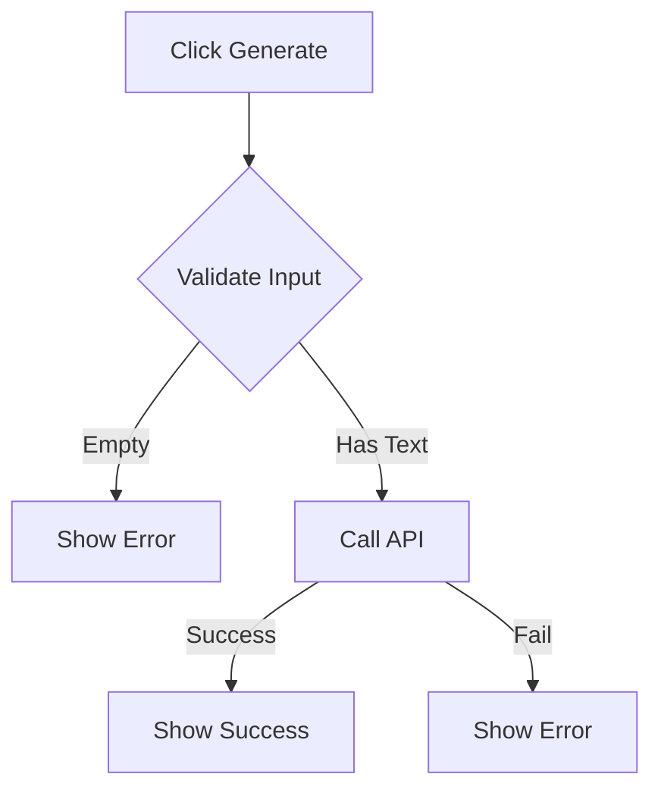

# Generate Button Restoration Guide

## Objective

Make the Generate button fully operational by isolating core functionality and removing non-essential dependencies.

## Core Requirements

1. Minimal Dependencies:

   - promptStore (input only)
   - submitPrompt API endpoint
   - Basic error display

2. Critical Flow:



## Emergency Restoration Steps

1. Isolate Core Functionality

   ```typescript
   // Minimal implementation
   async function generateOnly(prompt: string): Promise<boolean> {
     if (!prompt?.trim()) return false;

     try {
       const response = await fetch("/prompt", {
         method: "POST",
         headers: { "Content-Type": "application/json" },
         body: JSON.stringify({ prompt }),
       });

       return response.ok;
     } catch {
       return false;
     }
   }
   ```

2. Disable Non-Critical Features

   - Disable preview auto-update
   - Disable store chain updates
   - Remove content validation
   - Skip metadata processing

3. Simplified Error Handling

   - Use basic success/fail states only
   - Skip retry logic
   - Use console.error for logging

4. API Fallback Mode
   ```typescript
   // Fallback endpoint config
   const API_ENDPOINTS = {
     primary: "/prompt",
     fallback: "/api/generate",
     emergency: "/basic/generate",
   };
   ```

## Verification Steps

1. Basic Functionality Check

   - [ ] Button responds to clicks
   - [ ] API endpoint responds
   - [ ] Basic success/fail feedback

2. Input Validation

   - [ ] Accepts non-empty input
   - [ ] Blocks empty submissions

3. Error Cases
   - [ ] API timeout (10s max)
   - [ ] Network failure
   - [ ] Server error

## Development Instructions

1. Disable Complex Dependencies

   ```javascript
   // In PromptInput.svelte
   const EMERGENCY_MODE = true;

   // Disable store updates
   const updateStores = EMERGENCY_MODE
     ? () => {}
     : (content) => {
         /* normal store updates */
       };

   // Disable preview
   const triggerPreview = EMERGENCY_MODE
     ? () => {}
     : () => {
         /* normal preview */
       };
   ```

2. API Connection Check

   ```bash
   # Test API endpoint
   curl -X POST http://localhost:3000/prompt \
     -H "Content-Type: application/json" \
     -d '{"prompt":"test"}'
   ```

3. Minimal Response Format

   ```typescript
   // Success response
   HTTP 201
   {
     "success": true
   }

   // Error response
   HTTP 500
   {
     "success": false
   }
   ```

## Recovery Priorities

1. Button Click Handler

   - Ensure event binding works
   - Verify disabled state logic

2. API Connection

   - Test basic connectivity
   - Verify auth headers if required

3. User Feedback

   - Show loading state
   - Display basic success/error

4. Input Handling
   - Verify text capture
   - Ensure basic validation

## Testing Script

```javascript
// Minimal test script
async function testGenerate() {
  const button = document.querySelector('[data-testid="generate-button"]');
  const input = document.querySelector('[data-testid="prompt-textarea"]');

  if (!button || !input) {
    console.error("Required elements not found");
    return false;
  }

  input.value = "test prompt";
  button.click();

  // Wait for response
  await new Promise((r) => setTimeout(r, 2000));

  // Check button state
  return !button.disabled;
}
```

## Emergency Contacts

- Backend API: Check server/README.md for endpoint maintainer
- Frontend: Check client/src/components/README.md for component owner
- DevOps: Check deployment logs for environment issues

## Rollback Instructions

1. If changes fail, revert to last known good state:

   ```bash
   git checkout proto/aether-v00
   git reset --hard <last-working-commit>
   ```

2. Restore minimal working configuration:
   ```bash
   cp config/minimal.env .env
   npm run emergency-build
   ```

Remember: The goal is operational status of the Generate button, even if it means temporarily sacrificing other features. Full functionality can be restored incrementally once basic operation is confirmed.
